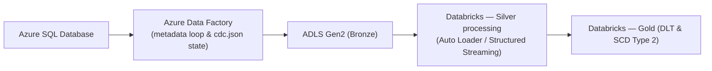

# Spotify End-to-End Data Engineering Project
  

This repository contains an end-to-end data engineering solution that extracts transactional data from an Azure SQL source, ingests it via an ADF-driven, metadata-configurable engine into ADLS Gen2 (bronze), and implements transformation and serving layers on Databricks (silver → gold) using Databricks Asset Bundles and Delta Live Tables.

## Architecture (high-level)

## Navigation
A short map to the main modules in this repository:

| Module | Purpose |
|---|---|
| ADF Ingestion Engine | [./adf/README.md](./adf/README.md) |
| Databricks Processing Core | [./spotify_dab/README.md](./spotify_dab/README.md) |

(Each module README contains implementation and operational details.)

## Key features
- Metadata-Driven Ingestion — ingestion behavior is controlled by metadata/config rather than hard-coded pipelines, enabling scalable table-by-table processing.
- File-Based State Management (Serverless) — pipeline watermarking and checkpoints are managed in lightweight JSON state files (cdc.json), suitable for serverless and repeatable runs.
- Databricks Asset Bundles & Delta Live Tables — transformations and SCD logic are packaged and deployed as Databricks Asset Bundles; Gold layer leverages DLT for continuous CDC and SCD Type 2 patterns.

## Tech stack (summary)

| Layer | Technology |
|---|---|
| Source | Azure SQL Database |
| Orchestration / Ingestion | Azure Data Factory (metadata loops) |
| Storage | Azure Data Lake Storage Gen2 (Bronze / Silver / Gold via Delta) |
| Compute / Transform | Databricks — Apache Spark, Delta Lake, Delta Live Tables (DLT) |
| Packaging / Deployment | Databricks Asset Bundles (DAB) |
| State / Watermarking | File-based (cdc.json) stored in ADLS |

